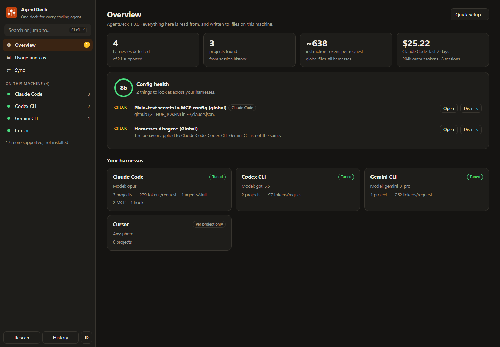
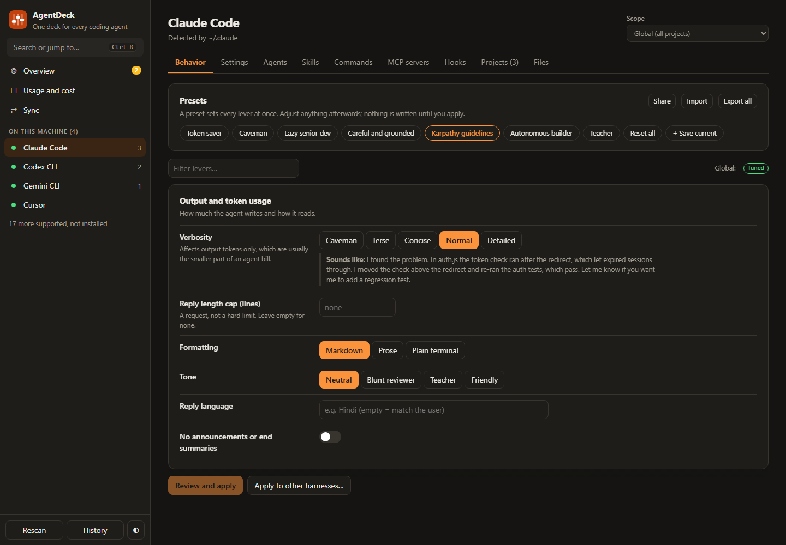
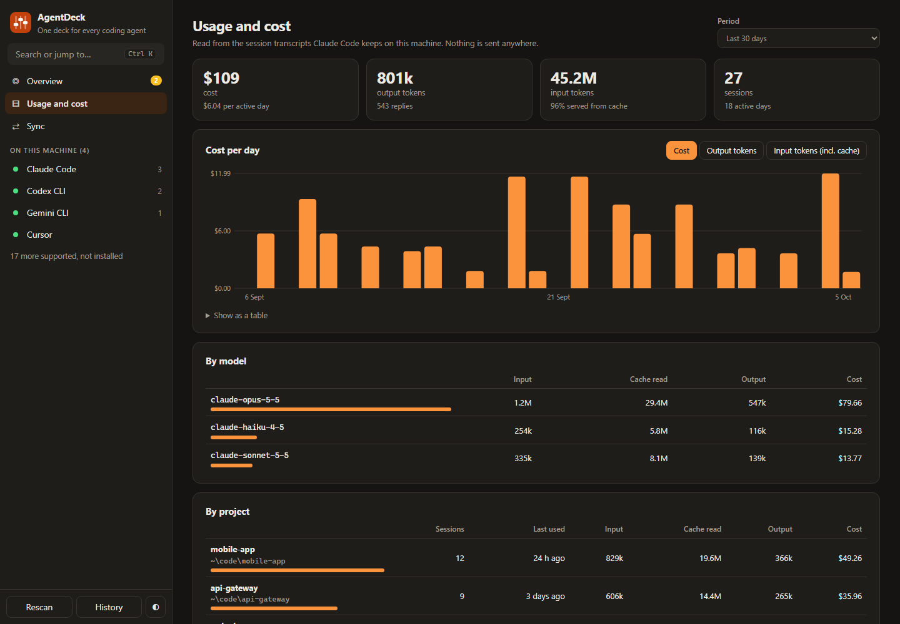

# AgentDeck

**One control panel for every AI coding agent on your machine.**

You run Claude Code, Codex, Gemini CLI, Cursor. Each keeps its behavior in a different file, in a different format, in a different folder. AgentDeck finds them all and gives you one window to tune how they talk, what they are allowed to do, what they cost, and whether they agree with each other.

```bash
npx github:PriyanshuGeTRekT/agentdeck
```

Local only. Zero dependencies. Every change is shown as a diff first and can be undone.



## What you get

| | |
|---|---|
| **Behavior levers** | About 25 controls (verbosity, grounding, scope, code volume, planning, testing, autonomy) and presets such as *Token saver*, *Caveman*, *Lazy senior dev* and *Karpathy guidelines*. Apply to one harness or all of them in one diff. |
| **Enforced settings** | Model, reasoning effort, approval mode, sandbox, compaction and output caps, written to each harness's own config. |
| **Permissions** | Allow, ask and deny lists with one-click rule sets, so you stop approving `git status` forty times a day without switching safety off. |
| **Hook recipes** | Block destructive commands, keep the agent out of `.env` files, make tests pass before it may finish. Plain Node scripts, so they work on Windows too. |
| **Usage and cost** | Tokens and cost by day, model and project, read from Claude Code's own transcripts. Nothing is uploaded. |
| **Health check** | Finds plain-text secrets in MCP configs, settings files that no longer parse, safety modes left off, hooks pointing at missing scripts, and instruction files that have outgrown their limit. |
| **Sync** | Shows where harnesses are being told different things, globally and per project, and makes them match. |
| **Agents, skills, commands, MCP** | Create from templates, edit, and copy one definition to several harnesses, each in its own location and format. |
| **History and undo** | A copy is saved before every write. Undo a whole action or restore one file. |





## Install

You need [Node.js](https://nodejs.org) 18 or later. Nothing else.

```bash
npx github:PriyanshuGeTRekT/agentdeck
```

or from a clone:

```bash
git clone https://github.com/PriyanshuGeTRekT/agentdeck.git
cd agentdeck
node server.js
```

AgentDeck opens in its own window (Chrome, Edge, Brave or Chromium in app mode) and stops when you close it. With none of those installed it opens a tab in your default browser.

- **Windows:** double-click `AgentDeck.vbs` for a window with no console. `install-shortcuts.ps1` adds Desktop and Start-menu shortcuts.
- **macOS:** double-click `AgentDeck.command`.
- **Linux:** run `./agentdeck.sh`.

### Terminal commands

```text
agentdeck                 open the app
agentdeck --browser       open in your default browser instead
agentdeck scan            list detected harnesses and their projects
agentdeck doctor          check your agent config for problems (exit 1 on serious ones)
agentdeck usage [days]    Claude Code tokens and cost, by model and project
agentdeck --port 5000     use another port (or set AGENTDECK_PORT)
```

`agentdeck doctor` is safe to run in CI or a pre-commit hook.

## Supported harnesses

<!-- matrix:start -->
| Harness | Instruction file | Settings | Agents, skills, commands | MCP | Hooks | Finds projects |
|---|---|---|---|---|---|---|
| Claude Code | `CLAUDE.md` | yes | agents, skills, commands | yes | yes | yes |
| Codex CLI | `AGENTS.md` | yes | agents, skills | yes | yes | yes |
| Gemini CLI | `GEMINI.md` | yes | agents, skills, commands | yes | yes | yes |
| Pi | `AGENTS.md` | yes | skills, commands |  |  | yes |
| OpenCode | `AGENTS.md` | yes | agents, skills, commands | yes |  | yes |
| Cursor | `AGENTS.md` | yes | agents, skills, commands | yes |  | yes |
| Windsurf / Devin Desktop | `global_rules.md` / `AGENTS.md` |  | skills, commands | yes |  | yes |
| GitHub Copilot CLI | `copilot-instructions.md` | yes | agents, skills | yes |  | yes |
| Qwen Code | `QWEN.md` | yes | agents, skills | yes |  | yes |
| Factory Droid | `AGENTS.md` | yes | agents, skills, commands | yes | yes | yes |
| Codewhale (DeepSeek TUI) | `AGENTS.md` | yes |  |  |  | yes |
| Kilo Code | `agentdeck.md` |  | agents, skills, commands |  |  |  |
| Cline | `agentdeck.md` / `AGENTS.md` |  | skills | yes |  |  |
| Kiro | `agentdeck.md` |  | skills | yes |  |  |
| Goose | `.goosehints` |  | skills |  |  | yes |
| Amp | `AGENTS.md` |  | skills | yes |  |  |
| Crush | `CRUSH.md` / `AGENTS.md` |  | skills |  |  |  |
| Zed Agent | `AGENTS.md` |  | skills |  |  |  |
| Continue | `agentdeck.md` |  |  |  |  | yes |
| Aider | `CONVENTIONS.md` |  |  |  |  |  |
| Roo Code (discontinued) | `agentdeck.md` |  |  |  |  |  |
<!-- matrix:end -->

Detection is by each tool's config folder, its binary on your `PATH`, or its editor extension. Harnesses that are not installed still appear, so you can prepare their files in advance. Adding one is a single entry in [`lib/adapters.js`](lib/adapters.js); see [CONTRIBUTING.md](CONTRIBUTING.md).

## What it writes, and where

AgentDeck only writes files that belong to a harness, and only when you click Apply on a diff.

- **Behavior levers** go into a marked block at the end of the harness's instruction file (`CLAUDE.md`, `AGENTS.md`, `GEMINI.md` ...). Everything outside the markers is yours and is never touched:

  ```markdown
  <!-- agentdeck:start (managed by AgentDeck: change it there, edits here are overwritten) -->
  # Working preferences
  ...
  <!-- agentdeck:end -->
  ```

- **Settings, permissions, MCP servers and hooks** go into the harness's own config file. Only the keys you changed are written; comments and unknown keys in TOML and frontmatter are preserved.
- **Agents, skills and commands** are ordinary files in the harness's folders.
- **Hook recipes** are small scripts saved in `~/.agentdeck/hooks/`.
- **AgentDeck's own data** (presets, history, backups) lives in `~/.agentdeck/`.

It only writes into project folders a harness has already worked in, or ones you add yourself.

## Honest limits

- **Behavior levers are instructions, not switches.** The agent reads them and usually follows them; nothing forces it to. There is no real "hallucination rate" or "creativity" dial, and most current models no longer accept a temperature setting. For anything that must always happen, use Settings, Permissions or a Hook: those are enforced by the harness.
- **Only Claude Code has been tested against a live install.** The other adapters follow each tool's documentation. Hook recipes use Claude Code's hook protocol; Codex and Factory Droid document the same protocol but have not been run end to end.
- **Usage and cost cover Claude Code only**, because it is the only harness that records cost in its transcripts.
- **Some tools do not document where they keep session history** (Kiro, Cline, Amp, Zed, Crush, Kilo). Add their project folders by hand from the Projects tab. Goose and newer OpenCode builds store history in SQLite, which needs Node 22.13 or later to read.
- **Config with comments is left alone.** If a JSON settings file contains comments, AgentDeck will not rewrite it and sends you to the raw editor instead.

## Security

AgentDeck is a local web server bound to `127.0.0.1`. Each run generates a random session key that every request must carry. The key is handed only to the window AgentDeck opens (and kept in a file only your user can read, so a second launch can reopen a running copy); it is never served over HTTP, so another user on the same machine cannot fetch it. The `Host` header is checked to stop DNS-rebinding, and a content security policy blocks anything not served by the app itself. It makes no network requests.

MCP secrets you enter are stored where the harness expects them, in plain text, which is how those tools work; the health check flags them. The destructive-command hook recipe is a safety net against mistakes, not a sandbox: keep your harness's own sandbox and approval settings on.

## Uninstall

Delete the `~/.agentdeck` folder (presets, history, backups, hook scripts) and remove any shortcuts. To remove what AgentDeck applied, press **Reset all** then **Apply** on each Behavior tab, or delete the marked block from the instruction files by hand. Hooks installed from recipes should be removed from the Hooks tab first, since they point at scripts in `~/.agentdeck/hooks/`.

## Development

```bash
npm test          # 65 tests, each file against its own throwaway home folder
npm run demo      # the UI on sample data, without touching your real config
npm run docs      # regenerate the harness table above from the code
```

No build step, no dependencies: `server.js` and `lib/` are plain Node, `public/` is plain ES modules.

## License

MIT
